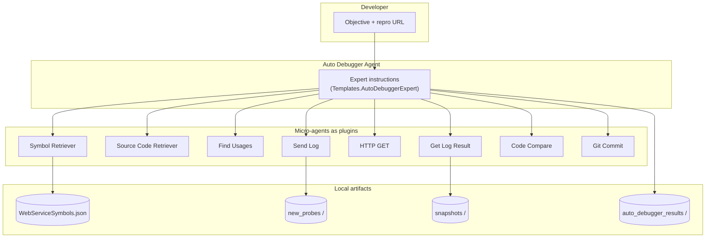

<div align="center">

# Auto Debugger

**AI-assisted .NET debugging prototype — inspect symbols and source, add runtime probes, capture snapshots, and iterate toward a fix.**

[](LICENSE)
[](https://dotnet.microsoft.com/)
[](https://github.com/microsoft/semantic-kernel)

[Report an issue](https://github.com/dudikeleti/auto-debugger/issues)

</div>

---

## What is this?

**Auto Debugger** is a research prototype that orchestrates a **primary “expert” agent** with several **specialist micro-agents** (Semantic Kernel experimental agents). Together they follow a practical debugging loop: map the codebase from structured symbols, pull the right source, trace call sites, **add lightweight logging probes**, **drive the app with HTTP** to exercise the path, **read back runtime snapshots**, propose a fix, optionally **diff** the before/after, and **commit** changes to a local Git repository.

It was built to explore how LLM tooling can close the loop between *static* reasoning and *dynamic* evidence—without replacing human judgment.

The initial version was written around mid-2023, in the ChatGPT 3.5 era, before MCP and today's coding-agent workflows became common. It explored how an agent could combine code inspection, runtime evidence, and iterative debugging actions in one loop.

---

## Highlights

| Capability | What you get |
|------------|----------------|
| **Multi-agent orchestration** | One coordinator plus focused agents (symbols, source, usages, HTTP, logs, diff, Git). |
| **Probe workflow** | Define probes as JSON, materialize them on disk, then collect snapshot JSON when your instrumented app runs. |
| **Traceability** | Each run writes a timestamped transcript with tool-call counts and parameters. |
| **Pluggable paths** | Symbols, snapshots, probes, results, and repo root are driven by environment variables (see below). |

---

## Architecture



---

## How the debugging loop works

The expert prompt (see `Templates/Templates.cs`) encodes a repeatable playbook:

1. **Understand structure** — Load method/class metadata from a JSON symbol graph (`Symbols/WebServiceSymbols.json` or `AD_SYMBOL_PATH`).
2. **Read code** — Fetch source by **full file path** and line range from the symbol information.
3. **Broaden the blast radius** — Use **Find Usages** (textual search under the project tree) to see callers and related call sites.
4. **Insert probes** — Register a log definition (JSON with `typeName` and `methodName`). The host writes probe descriptors under the **new probes** directory.
5. **Exercise the app** — Send an **HTTP GET** to the URI you provide (your API must be running and wired to consume probes / emit snapshots).
6. **Collect evidence** — **Get Log Result** waits for matching snapshot JSON in the **snapshots** directory (filesystem watcher with retry).
7. **Propose a fix** — Explain the issue and suggest code changes.
8. **Optional diff** — Launch **Beyond Compare** if installed (`AD_BC_PATH`) to compare original vs. proposed code.
9. **Optional commit** — Commit via **LibGit2Sharp** into the repository at `AD_REPOSITORY_PATH`.

After each assistant turn you can type a follow-up (or `exit`) in the console; the runner streams responses and persists a full diagnostic trace.

---

## Repository layout

| Path | Purpose |
|------|---------|
| `src/AutoDebugger/AutoDebugger/` | Core library: agents, Semantic Kernel plugins, probes, templates, bundled symbol sample. |
| `src/AutoDebugger/Example/` | Sample console entry point with a demo “goal” string. |
| `src/AutoDebugger/AutoDebugger.sln` | Visual Studio / `dotnet` solution. |
| `Results/` | Example run transcripts (from earlier experiments). |

---

## Prerequisites

- **[.NET 8 SDK](https://dotnet.microsoft.com/download)** (project targets `net8.0`).
- **OpenAI API access** — an API key with access to the configured chat model.
- **A running application** you can hit with HTTP for the scenario you are debugging (the sample objective assumes a local web API).
- **Optional:** [Beyond Compare](https://www.scootersoftware.com/) (or set `AD_BC_PATH` to your diff tool’s executable if you adapt the code).

---

## Configuration

Environment variables are read from the **current user** profile on Windows (`EnvironmentVariableTarget.User`). Set them once in System Properties → Environment Variables, or via PowerShell for your user:

| Variable | Required | Default / notes |
|----------|----------|-----------------|
| `AD_OPENAI_KEY` | **Yes** | OpenAI API key. |
| `AD_OPENAI_MODEL` | No | Defaults to `gpt-4-0125-preview`. |
| `AD_SYMBOL_PATH` | No | Defaults to bundled `WebServiceSymbols.json` under `Symbols/`. Point this at **your** exported symbol JSON for real projects. |
| `AD_REPOSITORY_PATH` | No | Defaults to a local demo repository path — **override this** to your clone. |
| `AD_RESULT_PATH` | No | Transcript output directory. Default: `%TEMP%\auto_debugger_results`. |
| `AD_SNAPSHOT_PATH` | No | Where snapshot JSON is expected. Default: `%TEMP%\snapshots`. |
| `AD_PROBES_PATH` | No | Where new probe JSON files are written. Default: `%TEMP%\new_probes`. |
| `AD_BC_PATH` | No | Beyond Compare `BComp.exe` path. |
| `AD_GIT_USER` / `AD_GIT_PASSWORD` | No | Reserved for future auth flows; Git commit plugin uses embedded author metadata today. |

> **Security:** Never commit API keys. Prefer user-level environment variables or secret managers, not checked-in `.env` files.

---

## Build and run

From the repository root:

```powershell
dotnet restore src\AutoDebugger\AutoDebugger.sln
dotnet build src\AutoDebugger\AutoDebugger.sln -c Release
dotnet run --project src\AutoDebugger\Example\Example.csproj -c Release
```

Set `AD_OPENAI_KEY` before running. The example uses a baked-in objective in `Example/Program.cs`; replace it with your own description, suspected type/method, and reproduction URL.

---

## Specialist agents (plugins)

Each capability is exposed to the model as a **Semantic Kernel** plugin backed by `DiagnosticPlugin` (counts and traces every invocation):

| Agent | Plugin | Role |
|-------|--------|------|
| Symbol Retriever | `SymbolRetrieverPlugin` | Resolve method metadata from the symbol JSON graph. |
| Source Code Retriever | `SourceCodeRetrieverPlugin` | Read a line range from a source file. |
| Find Usages | `FindUsagesPlugin` | Heuristic search for `methodName(` across `*.cs` files under the project. |
| Send Log | `SendLogPlugin` | Write probe JSON to `AD_PROBES_PATH` and return an ID. |
| Send HTTP GET | `SendHttpGetRequestPlugin` | Trigger your running app. |
| Get Log Result | `GetLogResultPlugin` | Load snapshot JSON for probe IDs from `AD_SNAPSHOT_PATH`. |
| Code Comparison | `CodeComparerPlugin` | Launch Beyond Compare on two code blobs. |
| Git Commit | `GitCommiterPlugin` | Create a commit in `AD_REPOSITORY_PATH` (demo behavior). |

---

## Dependencies

- [Microsoft Semantic Kernel — Experimental Agents](https://github.com/microsoft/semantic-kernel) (`Microsoft.SemanticKernel.Experimental.Agents`)
- [LibGit2Sharp](https://github.com/libgit2/libgit2sharp)
- [Newtonsoft.Json](https://www.newtonsoft.com/json)

---

## Status

- This is an **R&D / week-project** prototype rather than a maintained product.
- Some implementation details reflect the state of LLM and Semantic Kernel tooling at the time it was built.
- **Symbol graph** quality depends on your `WebServiceSymbols.json` (or equivalent export).
- **Find Usages** is a simple text search, not Roslyn-accurate reference analysis.
- **Git commit** and **diff** flows are intentionally lightweight.

---

## License

This project is licensed under the [MIT License](LICENSE).

---

<div align="center">

**Built to explore practical debugging agents — from hypothesis to evidence to patch.**

</div>
